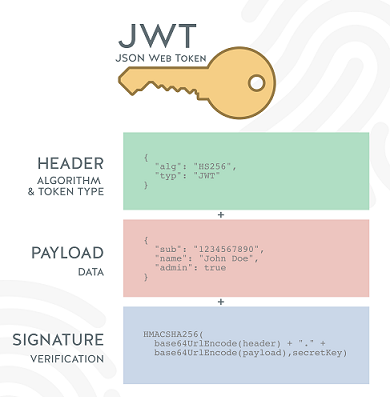
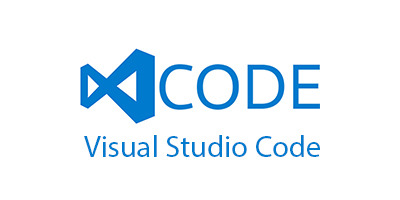
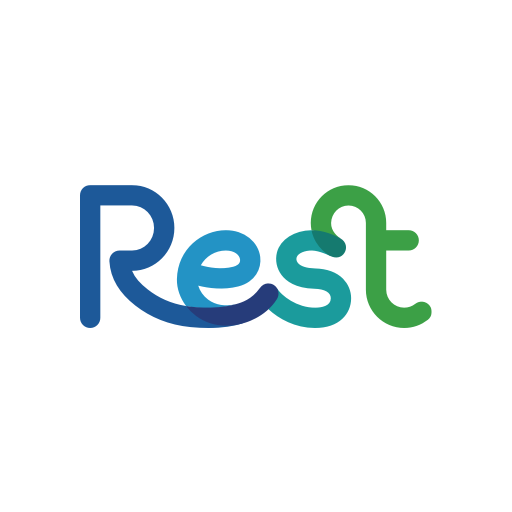

<!-- WIP -->

<h1 align="center">Projeto NodeJs - Blogs API</h1>

 
  

  

<!-- TABLE OF CONTENTS -->
<h2 id="table-of-contents"> :book: Tabela de Conteúdos</h2>

  
Tabela de conteúdos

  <ol>
    <li><a href="#sobre"> ➤ Sobre o projeto</a></li>
    <li><a href="#tecnologias"> ➤ Tecnologias utilizadas</a></li>
    <li><a href="#descrição-do-projeto"> ➤ Descrição do projeto</a></li>
    <li><a href="#instruções"> ➤ Instruções</a></li>
    <li><a href="#requisitos"> ➤ Requisitos realizados </a></li>
    <li><a href="#requisito1"> ➤ Requisito 1: Criação de migrations para as entidades relacionais </a></li>
    <li><a href="#requisito2"> ➤ Requisito 2: Criação do model de usuário </a></li>
    <li><a href="#requisito3"> ➤ Requisito 3: Criação do endpoint POST `/login` </a></li>
    <li><a href="#requisito4"> ➤ Requisito 4: Criação do endpoint POST `/user` </a></li>
    <li><a href="#requisito5"> ➤ Requisito 5: Criação do endpoint GET `/user` </a></li>
    <li><a href="#requisito6"> ➤ Requisito 6: Criação do endpoint GET `/user/:id` </a></li>
    <li><a href="#requisito7"> ➤ Requisito 7: Criação do model de categoria </a></li>
    <li><a href="#requisito8"> ➤ Requisito 8: Criação do endpoint POST `/categories` </a></li>
    <li><a href="#requisito9"> ➤ Requisito 9: Criação do endpoint GET `/categories` </a></li>
    <li><a href="#requisito10"> ➤ Requisito 10: Criação do model de blogpost </a></li>
    <li><a href="#requisito11"> ➤ Requisito 11: Criação do model de postcategory </a></li>
    <li><a href="#requisito12"> ➤ Requisito 12: Criação do endpoint POST `/post` </a></li>
    <li><a href="#requisito13"> ➤ Requisito 13: Criação do endpoint GET `/post` </a></li>
    <li><a href="#requisito14"> ➤ Requisito 14: Criação do endpoint GET `/post/:id` </a></li>
    <li><a href="#requisito15"> ➤ Requisito 15: Criação do endpoint PUT `/post/:id` </a></li>
    <li><a href="#requisito16"> ➤ Requisito 16: Criação do endpoint DELETE `/post/:id` </a></li>
    <li><a href="#requisito17"> ➤ Requisito 17: Criação do endpoint DELETE `/user/me` </a></li>
    <li><a href="#requisito18"> ➤ Requisito 18: Criação do endpoint GET `/post/search` </a></li>
    <li><a href="#créditos"> ➤ Créditos </a></li>
  </ol>

  

<h2 id="sobre"> :pencil: Sobre o projeto </h2>

  
Projeto desenvolvido durante a formação de BackEnd na Trybe com o intuito de consolidar o aprendizado de NodeJs utilizando o framework Express, Sequelize como ferramenta ORM e JWT para criação e autenticação de token. Foram seguidos os padrões arquiteturais MSC e REST.
    
  
  

  

<h2 id="tecnologias"> :computer: Tecnologias utilizadas</h2>

  
  
  
  
   
   
  
  
   
  
  
  
  

  

<h2 id="descrição-do-projeto"> :page_facing_up: Descrição</h2>

  
Descrição
 
  Foi desenvolvida uma API e um banco de dados para a produção de conteúdo para um blog.  
  
  Neste projeto eu realizei:
  
  <ol>
    <li>Desenvolvimento de endpoints conectados ao db seguindo os princípios REST</li>
    <li>Conexão entre um usuário e login para realização de postagens</li>
    <li>Conexão entre posts e categorias no db</li>
    <li>Configuração e manipulação do jwt como ferramenta de autenticação de tokens</li>
  </ol> 

  Durante o desenvolvimento foi utilizado Docker.   

  

<h2 id="instruções"> :scroll: Instruções</h2>

1. Clone o repositório
  * `git clone git@github.com:Gabrielle-Murat/NodeJs-BlogsAPI.git`
  * Entre na pasta do repositório que você acabou de clonar;
 

2. Instale as dependências:
  * `npm install`
 

3. Utilizando Docker:
  * Rode os serviços `node` e `db` com o comando `docker-compose up -d --build` (adapte a porta padrão, se necessário),
  * Com isso, serão inicializados dois containers: `blogs_api` e `blogs_api_db`
  * Use o comando `docker exec -it blogs_api bash` (para acessar o terminal interativo do container `blogs_api`),
  * Instale as dependências com `npm install`
  * Todos os comandos disponíveis no `package.json` agora podem ser executados no terminal do container
 
  
4. Para iniciar o servidor em modo de desenvolvimento:
  * Execute o comando: `npm run debug`
 
    

  

<h2 id="requisitos"> :woman_technologist: Requisitos Realizados:</h2>

  
Criação de API para Blog:

  <h4 id="requisito1">Requisito 1: Criação de migrations para as entidades relacionais </h4>
  
    1. Criar um :
      1.1. 
      1.2. 

  <h4 id="requisito2">Requisito 2: Criação do model de usuário </h4>
  
    2. Criar um :
      2.1. 
      2.2. 

  <h4 id="requisito3">Requisito 3: Criação do endpoint POST `/login` </h4>
  
    3. Criar um :
      3.1. 
      3.2. 
      3.3. 
      3.4. 

  <h4 id="requisito4">Requisito 4: Criação do endpoint POST `/user` </h4>
  
    4. Validar :
      4.1. 
      4.2. 
      4.3. 

  <h4 id="requisito5">Requisito 5: Criação do endpoint GET `/user` </h4>
  
    5. Criar um :
      5.1. 
      5.2. 
      5.3. 
      5.4. 
      5.5. 
      5.6. 
      5.7. 
      5.8. 
      5.9. 
      5.10. 

  <h4 id="requisito6">Requisito 6: Criação do endpoint GET `/user/:id` </h4>
  
    6. Criar um :
      6.1. 
      6.2. 
      6.3. 
      6.4. 
      6.5. 

  <h4 id="requisito7">Requisito 7: Criação do model de categoria </h4>
  
    7. Criar um :
      7.1. 
      7.2. 
      7.3. 

  <h4 id="requisito8">Requisito 8: Criação do endpoint POST `/categories` </h4>
  
    8. Criar em :
      8.1. 
      8.2. 
      8.3. 
      8.4. 
      8.5. 

  <h4 id="requisito9">Requisito 9: Criação do endpoint GET `/categories` </h4>
  
    9. 

  <h4 id="requisito10">Requisito 10: Criação do model de blogpost </h4>
  
    10. 

  <h4 id="requisito11">Requisito 11: Criação do model de postcategory </h4>
  
    11. 
  
  <h4 id="requisito12">Requisito 12: Criação do endpoint POST `/post` </h4>
  
    12. 
  
  <h4 id="requisito13">Requisito 13: Criação do endpoint GET `/post` </h4>
  
    13. 
  
  <h4 id="requisito14">Requisito 14: Criação do endpoint GET `/post/:id` </h4>
  
    14. 
  
  <h4 id="requisito15">Requisito 15: Criação do endpoint PUT `/post/:id` </h4>
  
    15. 

  <h4 id="requisito16">Requisito 16: Criação do endpoint DELETE `/post/:id` </h4>
  
    16. 

  <h4 id="requisito17">Requisito 17: Criação do endpoint DELETE `/user/me` </h4>
  
    17. 
  
  <h4 id="requisito18">Requisito 18: Criação do endpoint GET `/post/search` </h4>
  
    18. 

 

  

<h2 id="créditos"> 💳 Créditos</h2>

Arquivo de caminhos para o sequelize (.sequelizerc), docker compose (docker-compose.yml), dockerfile (Dockerfile), o arquivo (config.js) contido no caminho `src>database>config` e os seeders para popular o db contidos no caminho `src>database>seeders`, foram fornecidos pela Trybe.

